---
## Front matter
title: "Отчёта по лабораторной работе 5"
subtitle: "Основы работы с Midnight Commander (mc). Структура программы на языке ассемблера NASM"
author: "Субанов Юсуф Жура угли	НПМбв-01-21"

## Generic otions
lang: ru-RU
toc-title: "Содержание"

## Bibliography
bibliography: bib/cite.bib
csl: pandoc/csl/gost-r-7-0-5-2008-numeric.csl

## Pdf output format
toc: true # Table of contents
toc-depth: 2
lof: true # List of figures
lot: true # List of tables
fontsize: 12pt
linestretch: 1.5
papersize: a4
documentclass: scrreprt
## I18n polyglossia
polyglossia-lang:
  name: russian
  options:
	- spelling=modern
	- babelshorthands=true
polyglossia-otherlangs:
  name: english
## I18n babel
babel-lang: russian
babel-otherlangs: english
## Fonts
mainfont: PT Serif
romanfont: PT Serif
sansfont: PT Sans
monofont: PT Mono
mainfontoptions: Ligatures=TeX
romanfontoptions: Ligatures=TeX
sansfontoptions: Ligatures=TeX,Scale=MatchLowercase
monofontoptions: Scale=MatchLowercase,Scale=0.9
## Biblatex
biblatex: true
biblio-style: "gost-numeric"
biblatexoptions:
  - parentracker=true
  - backend=biber
  - hyperref=auto
  - language=auto
  - autolang=other*
  - citestyle=gost-numeric
## Pandoc-crossref LaTeX customization
figureTitle: "Рис."
tableTitle: "Таблица"
listingTitle: "Листинг"
lofTitle: "Список иллюстраций"
lotTitle: "Список таблиц"
lolTitle: "Листинги"
## Misc options
indent: true
header-includes:
  - \usepackage{indentfirst}
  - \usepackage{float} # keep figures where there are in the text
  - \floatplacement{figure}{H} # keep figures where there are in the text
---

# Цель работы

Целью работы является приобретение практических навыков работы в Midnight Commander. 
Освоение инструкций языка ассемблера mov и int.

# Выполнение лабораторной работы

1. Откроем Midnight Commander

2. Перейдем в каталог ~/work/arch-pc

3. Создадим каталог lab05

{ #fig:001 width=70%, height=70% }

4. Создадим файл lab05-1.asm

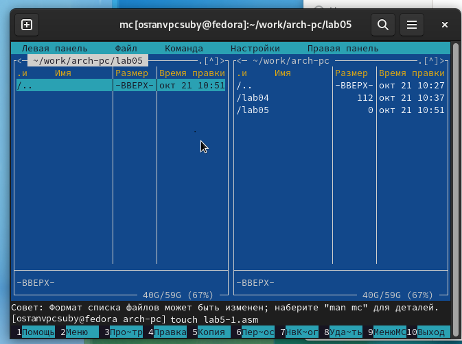{ #fig:002 width=70%, height=70% }

5. Откроем файл на редактирование

6. Напишем код

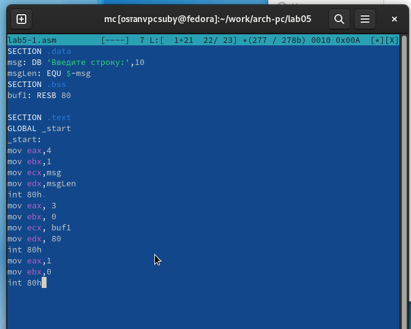{ #fig:003 width=70%, height=70% }

```
SECTION .data
msg: DB 'Введите строку:',10
msgLen: EQU $-msg
SECTION .bss
buf1: RESB 80

SECTION .text
GLOBAL _start
_start:
mov eax,4
mov ebx,1
mov ecx,msg
mov edx,msgLen
int 80h 
mov eax, 3
mov ebx, 0
mov ecx, buf1
mov edx, 80
int 80h
mov eax,1
mov ebx,0
int 80h
```

7. Откроем файл на просмотр и проверим.

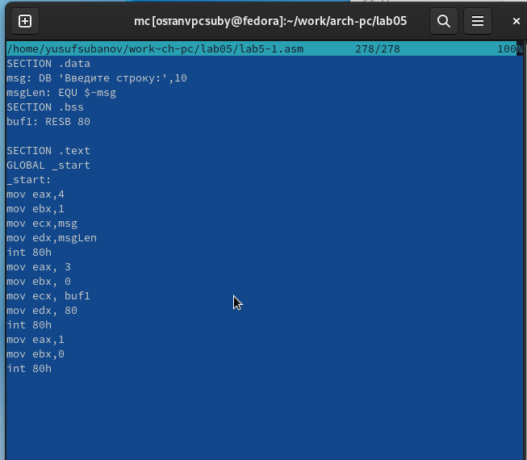{ #fig:004 width=70%, height=70% }

8. Скомпилировали программу и провреили запуск.

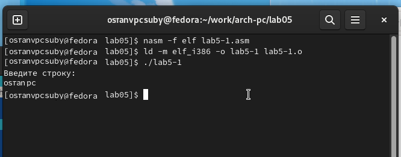{ #fig:005 width=70%, height=70% }

9. Скачали файл in_out.asm.

10. Добавили файл in_out.asm в рабочий каталог.

11. Скопировали lab05-1.asm в lab05-2.asm.

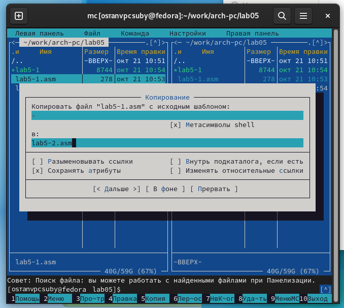{ #fig:006 width=70%, height=70% }

12. Написали код программы lab05-2.asm. Скомпилировали программу и провреили запуск.

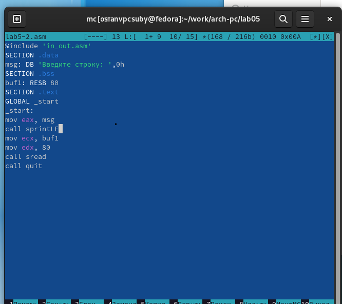{ #fig:007 width=70%, height=70% }

```
%include 'in_out.asm'
SECTION .data
msg: DB 'Введите строку: ',0h
SECTION .bss
buf1: RESB 80
SECTION .text
GLOBAL _start
_start:
mov eax, msg
call sprintLF
mov ecx, buf1
mov edx, 80
call sread
call quit
```

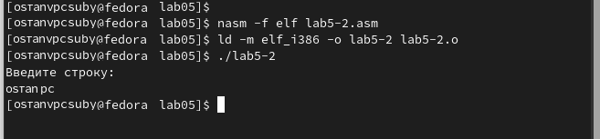{ #fig:008 width=70%, height=70% }

13. В файле lab5-2.asm заменили подпрограмму sprintLF на sprint. Теперь после вывода строки ввод происходит в ту же строку.

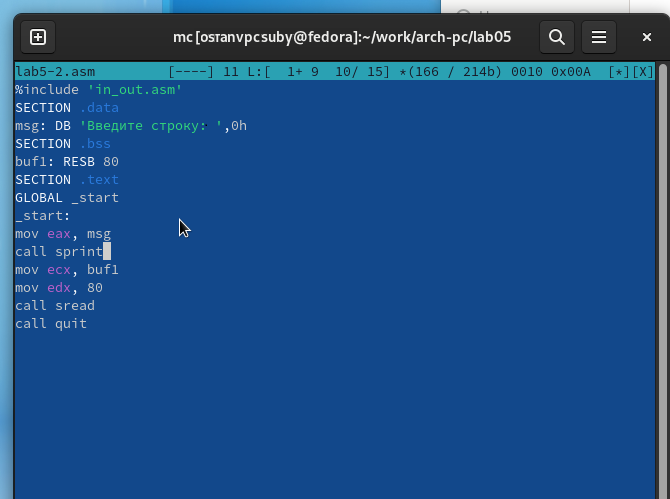{ #fig:009 width=70%, height=70% }

```
%include 'in_out.asm'
SECTION .data
msg: DB 'Введите строку: ',0h
SECTION .bss
buf1: RESB 80
SECTION .text
GLOBAL _start
_start:
mov eax, msg
call sprint
mov ecx, buf1
mov edx, 80
call sread
call quit
```

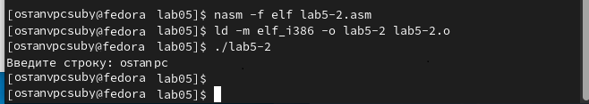{ #fig:010 width=70%, height=70% }

14. Скопировали программу lab05-1.asm и изменили код, чтобы выводить введенную строку.

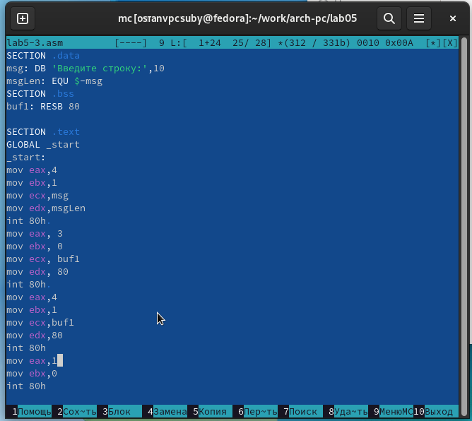{ #fig:011 width=70%, height=70% }

```
SECTION .data
msg: DB 'Введите строку:',10
msgLen: EQU $-msg
SECTION .bss
buf1: RESB 80

SECTION .text
GLOBAL _start
_start:
mov eax,4
mov ebx,1
mov ecx,msg
mov edx,msgLen
int 80h 
mov eax, 3
mov ebx, 0
mov ecx, buf1
mov edx, 80
int 80h 
mov eax,4
mov ebx,1
mov ecx,buf1
mov edx,80
int 80h
mov eax,1
mov ebx,0
int 80h
```

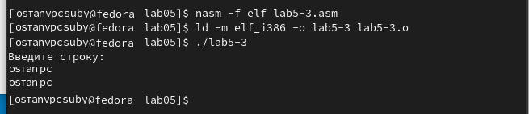{ #fig:012 width=70%, height=70% }

15. Скопировали программу lab05-2.asm и изменили код, чтобы выводить введенную строку.

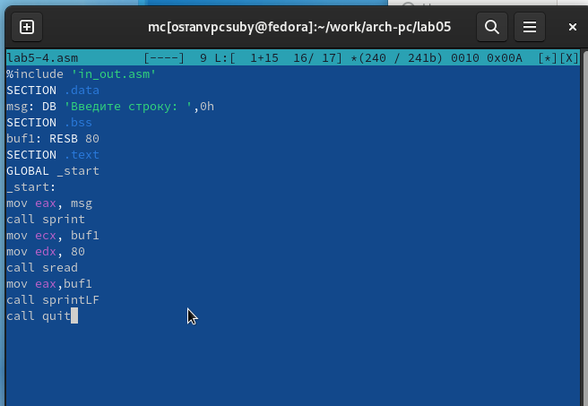{ #fig:013 width=70%, height=70% }

```
%include 'in_out.asm'
SECTION .data
msg: DB 'Введите строку: ',0h
SECTION .bss
buf1: RESB 80
SECTION .text
GLOBAL _start
_start:
mov eax, msg
call sprint
mov ecx, buf1
mov edx, 80
call sread
mov eax,buf1
call sprintLF
call quit
```

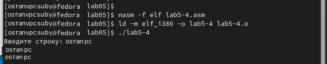{ #fig:014 width=70%, height=70% }

# Выводы

Научились писать базовые ассемблерные программы. Освоили ассемблерные инструкции mov и int.
